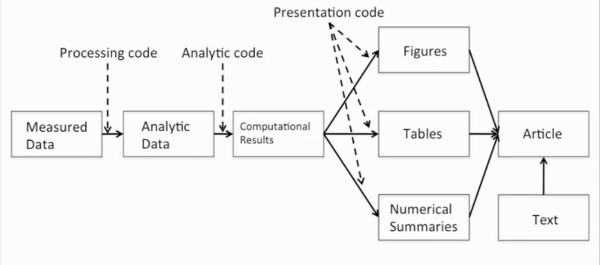

```{r setup, include=FALSE}
knitr::opts_chunk$set(echo = TRUE)
```

# Intro  
* Reproducible Research applies to data analysis but also any sort of processing of data to help convey what has been done to the data so an analyis can be reproduced in the future.  
* This course will cover the tools one can use in R to communicate what one has done with the data  

## Course Description  
* "**In this course you will learn the ideas of reproducible research and reporting of statistical analyses. Topics covered include literate programming tools, evidence-based data analysis, and organizing data analyses. In this course you will learn to write a document using R markdown, integrate live R code into a literate statistical program, compile R markdown documents using knitr and related tools, publish reproducible documents to the web, and organize a data analysis so that it is reproducible and accessible to others.**"  

## Course Book  
**(The book can be downloaded as a pdf from leanpub)[https://leanpub.com/reportwriting]**  

## What is Reproduciblity about?
* Peng makes an analogy between data science and music, he compares two songs:
        + **(Code Monkey)[https://www.youtube.com/watch?v=qYodWEKCuGg]**  
        + **(Symphony No. 8)[https://www.youtube.com/watch?v=e7WgXhUBrps]**
* The second song is quite complex, it's even been nicknamed "Symphony of a Thousand" for the amount of people required to perform it. The score that comes with it gives detailed information of what every section is to be doing during the piece. 
* In addition, *Mahler* was a conducter and often felt frustrated with scores that had complex parts but didn't convey enough information about what the composer wanted. So when he wrote his music he wrote detailed instructions with the score.
* In Data analysis there is no one unified way that the "score" of a data analysis is conveyed. As such everyone has thier own way from describing what was done to providing all the code. The first can sometimes be lacking and the second can seem to be an information overload.  


# Concepts, Ideas, & Structure  
## Concepts and Ideas (Part 1)  
### Replication  
* The ulitimate standard for strengthening scientific evidence is replication of findings and conducting studies with independent:
        + Investigators  
        + Data  
        + Analytical methods  
        + Laboratories  
        + Instruments  
* Replication is particularly important in studies that can impact broad policy or regulatory decisions  

**However**,
* Some studies cannot/can be challenging to be replicated  
        + No time, studies nowadays require large sample sizes  
        + No money, researchers gotta eat too  
        + Unique, sometimes a study is of a particular subset (Air Pollution, 'rona)  
* Reproducible Research makes analytic data and code available so that others may reproduce findgs; a middle ground between replication and nothing  

### Why Do We Need Reproducible Research?  
* New technologies increasing data collection throughput; data are more complex and extremely high dimensional  
* Existing data bases can be merged into new "megadatabases"  
* Computing power is greatly increased, allowing more sophisticated analyses  
        + Kinda like using DNA evidence for old cold cases  
* For every field "X" there is a field "Computational X"  
        + Reproducing the Computational X from the X will allows others to be confident the correct analysis was done  

### Example: Reproducible Air Pollution and Health Research  
* Estimating small (but important) health effects in the presence of much stronger signals  
        + Air pollution lightly impacts health but still effects it enough.. on occasion  
* Results inform substantial policy decisions, affect many stakeholders  
        + EPA regulations can cost billions of dollars, so the research must be reproducible to convey the reason for the need of these new regulations  
* Complex statistical methods are needed and subjected to intense scrutiny  
* See Also: Internet-based Health and Air Pollution Surveillance System (iHAPSS)  

## Concepts and Ideas (Part 2)  
### Research Pipeline  
* When you read an article you only get the article, not the data that are behind it.  
* This is where the research pipeline comes in..  
  
  
### Recent Developments in Reproducible Research  
**(The Duke Saga)[https://www.youtube.com/watch?v=eV9dcAGaVU8&feature=emb_err_watch_on_yt]**  
**(Evolution of Translational Omics: Lessons Learned and the Path Forward)[https://www.nap.edu/catalog/13297/evolution-of-translational-omics-lessons-learned-and-the-path-forward]**  
* In the Discovery/Test Validation stage of omics-based tests:  
        + **Data/metadata** used to develop test should be made publicly available  
        + The **computer code** and fully specified computational procedures used for development of the candidate omics-based test should be made sustainably available  
        + "Ideally, the computer code that is released will **encompass all of the steps of computational analysis**, including all data preprocessing steps, that have been described in this chapter. All aspects of the analysis need to be transparently reported."  
        
### What do We Need for Reproducible Research?
* Analytic data are available  
* Analytic code are available  
* Documentation of code and data  
* Standard means of distribution  

Who are the Players:
* Authors  
        + Want to make their research reproducible  
        + Want tools for RR to make their lives easier (or at least not much harder)  
* Readers  
        + Want to reproduce (and perhaps expand upon) interesting findings  
        + Want tools for RR to make their lives easier  
        
### Challenges  
* Authors must undertake considerable effor to put data/results on the web (may not have resources like a web server)  
* Readers must download data/results individually and piece together which data go with which code sections, etc.  
* Readers may not have the same resources as authors  
* Few tools to help authors/readers (although toolbox is growing!)  

In Reality...  
* Authors
        + Just put stuff on the web  
        + (Infamous) Journal supplementary materials skewed about  
        + There are some central databases for various fields (e.g. biology, ICPSR)  
* Readers  
        + Just download the data and (try to) figure it out  
        + Piece together the software and run it  


## Concepts and Ideas (Part 3)  
### Literate (Statistical) Programming  
* An article is a stream of **text** and **code**  
* Analysis code si divided into text and code "chunks"  
* Each code chunk loads data and computes results  
* Presentation code formats results (tables, figures, etc.)  
* Article text explains what is going on  
* Literate programs can be **weaved** to produce human-readable documents and **tangled** to produce machine-readable documents  

* Literate programming is a general concept that requires:  
1) A documentation language (human readable)  
2) A programing language (machine readable)  

### Sweave  
* Pronounced S-weave
* Uses L[A]T_E_X (Pretend that worked) and R as the documentation and programming languages  
* Sweave was developed by Friedrich Leisch (member of the R Core) and is maintained by R core  
* **[Website](http://www.statistik.lmu.de/~leisch/Sweave)**  

Limitations:
* Focused primarily on LaTeX, a difficult to learn markup language used "only by weirdos"  
* Lacks features like caching, multiple plots per chunk, mixing programming languages and many other technical items  
* Not frequently updated or very actively developed  

### knitr  
* knitr si an alternative (more recent) package  
* Brings together many features added on to Sweave to address limitations  
* knitr uses R as the programming language (although others are allowed) and variety of documentation languages  
        + LaTeX, Markdown, HTML  
* knitr was developed by Yihui Xie (while a graduate student in statistics at Iowa State)  
* **[Website](http://yihui.name/knitr/)**  

**Reminder to commit, delete this line** ***AFTER*** **committing**  

### Summary  
* Reproducible research is important as a **minimum standard**, particularly for studies that are difficult to replicate  
* Infrastructure is needed for **creating** and **distributing** reproducible documents, beyhond what is currently available  
* There is a growing number of tools for creating reproducible documents  

## Scipting Your Analysis  
* Scripting everything helps make your work as reproducible as possible  
* In the past one may have written everything down in a lab notebook, but now with computers we document everything with scripts in computers  
* To make an analogy to music, the final paper/presentation is like the melody, but the exploratory work is like the supporting instruments in a song  
* Simular to a score in music we need a way to document everything that's going on in an analysis, this is the script  


## Structure of a Data Analysis (Part 1): Defining to Cleaning  
* General steps in a data analysis:
  + Define the question  
  + Define the ideal data set  
  + Determine what data you can access  
  + Obtain the data  
  + Clean the data  
  + Exploratory data analysis  
  + Statistical prediciton/modeling  
  + Interpret results  
  + Challenge results  
  + Synthesize/write up results  
  + Create reproducible code  
  
"*Ask yourselves, what problem have you solved, ever, that was worth solving, where you knew all fo the given information in advance? Where you* ***didn't*** *have a surplus of information and have to filter it out, or you had insufficent information and have to go find some?*" - Dan Myer, Maths Educator; **[TED talk "Math class needs a makeover"](https://www.youtube.com/watch?v=qocAoN4jNwc)**  

* A lot of the process of data analysis is filtering through all the information  

### Defining a question  
* The more effort you can put into coming up with a reasonable question, the less effort you'll have to spend sorting through a lot of stuff; most powerful dimension reduction tool you can employ.
* Narrowing down question will reduce potential noise in a large data set  
* The science will determine the question, leading to the data, leading to the applied statistics, from here one could develop theoretical statistics should their skill allow  
* The applied statistics have to be thoruhgly thought through to use the appropriate methods to make some conclusion  

An example:
* Start with a general question  
  + Can I automatically detect emails that are SPAM and those that are not?
(Side Note: SPAM email comes from a reference to **[this Monty Python sketch](https://vimeo.com/329001211)**, as such legit email is classified as "HAM")  

* Make it concrete  
  + Can I use quantitative characteristics of the emails to classify them as SPAM/HAM?  
  
### Define the ideal data set  
* The data set may depend on your goal  
  + Descriptive - a whole population  
    - Ex: All of the emails in the universe  
  + Exploratory - a random sample with many variables measured  
  + Inferential - the right population, randomly sampled  
    - Have to be careful of the sampling mechanism and the population you're drawing from  
  + Predictive - a training and test data set from the same population  
  + Causal - data from a randomized study  
    - "If I modify this compenet, something else will happen  
  + Mechanistic - data about all components of the system  
  
Our example:  
* One could get all the emails **[from googles datacenter](http://www.google.com/about/datacenters/inside)**

### Determine what data you can access  
* Sometimes you can find data free on the web  
* other times you may need to buy the data  
* Be sure to respect the terms of use  
* If the data don't exist, you may need to generate it yourself  

Our example:  
* Google's data center security is quite high and getting *everyone's* emails would be releasing some personal information so we'll probably have to go with something else, **[since Google isn't evil](https://en.wikipedia.org/wiki/Don't_be_evil)**  

* A possible solution is to use **[the Spambase dataset](http://archive.ics.uci.edu/ml/datasets/Spambase)**  


### Obtain the data  
* Try to obtain the raw data  
* Be sure to reference the source  
* Polite emails go a long way if you need data from someone  
* If you will load the data from an internet source, record the url and time accessed  
  
**(Data set for our example comes with the kernlab package.)[http://search.r-project.org/library/kernlab/html/spam.html]** How the data was previously processed is also documented in that link.  

### Clean the data  
* Raw data often needs to be processed  
* If it is pre-processed, make sure you understand how  
* Understand the source of the data (sensus, sample, convenience sample, etc.)  
* May need reformating, subsampling - record these steps so they can be reproduced  
* **Determine if the data are good enough** - if not, quit or change data  

Out cleaned data set  
```{r}
library(kernlab)
data(spam)
str(spam[, 1:5])
```


## Structure of a Data Analysis (Part 2): Exploring to Creating Reproducible Code  
### Subsampling our data into test & train sets  
```{r}
library(kernlab)
data(spam)
set.seed(3435)
trainIndicator <- rbinom(nrow(spam), size = 1, prob = 0.5)
table(trainIndicator)
trainSpam <- spam[trainIndicator == 1, ]
testSpam <-  spam[trainIndicator == 0, ]
```

### Exploratory data analysis  
* Look at summaries of the data  
* Check for missing data  
* Create exploratory plots  
* Perform exploratory analyses (e.g. clustering)  

```{r}
#Checkin' out data
names(trainSpam)
head(trainSpam) #freq of words in emails
```

```{r}
#Look at some plots
plot(trainSpam$capitalAve ~ trainSpam$type)#Avg capital letters
#Data is hard to see so looking at the log will help
plot(log10(trainSpam$capitalAve + 1) ~ trainSpam$type) 
# add 1 to evaluate 0s - ok for exploring, not reports
```
* The second plot helps us see the freq of capitals in spam is higher than in nonspam  

Relationships between predictors:  
```{r}
plot(log10(trainSpam[, 1:4] + 1))
```
* Words in the diagonal tell what predictor those respective rows & cols are looking at  
  + Referred to as a "Paris plot"  
  
Clustering:  
```{r}
hCluster = hclust(dist(t(trainSpam[, 1:57])))
plot(hCluster)
```
* not very informative since info is skewed, so clustering a log might give a better insight  

```{r}
hClusterUpdated <- hclust(dist(t(log10(trainSpam[, 1:55] + 1))))
plot(hClusterUpdated)
```

### Statistical prediction/modeling  
* Should be informed by the sefults of your exploratory analysis  
* Exact methods depend on the question of interest  
* Transformations/processing should be accounted for when necessary  
* Measures of uncertainty should be reported  
Example:  
```{r echo = TRUE, include = FALSE}
# Use a logistic regression to determine which variable has the min  
# error from the regression
trainSpam$numType <- as.numeric(trainSpam$type) - 1
costFunction = function(x, y) sum(x != (y > 0.5))
cvError = rep(NA, 55)
library(boot)

for (i in 1:55) {
  lmFormula = reformulate(names(trainSpam)[i], response = "numType")
  glmFit = glm(lmFormula, family = "binomial", data = trainSpam)
  cvError[i] = cv.glm(trainSpam, glmFit, costFunction, 2)$delta[2]
}
#The above loop was causing a spew of warnings so I segmented the parts that
#include output to hide these warnings

```
```{r}
#Which predictor has minimum cross-validated error?
names(trainSpam)[which.min(cvError)]
```

Get a measure of uncertainty  
```{r}
## Use the best model from the group
predictionModel = glm(numType ~ charDollar, 
                      family = "binomial", data = trainSpam)

## Get predictions on the test set
predictionTest = predict(predictionModel, testSpam)
predictedSpam = rep("nonspam", dim(testSpam)[1])

## Arb. Classify as 'spam' for those with prob > 0.5
predictedSpam[predictionModel$fitted > 0.5] = "spam"
head(predictedSpam)
```

Get a measure of uncertainty  
```{r}
## Classification table
result <- table(predictedSpam, testSpam$type)
result
## Error rate
errors <- result[1,2] + result[2,1]
total <- sum(result[1:2,1:2])
print(paste0(errors, " errors occured out of ", 
      total, " readings resulting in an error rate of ",
      round(errors/total, 4)))
```

### Interpret results  
* Use the appropriate language  
  + "describes"  
  + "correlates with/associated with"  
  + "leads to/causes"  
  + "predicts"  
* Give an explanation  
* Interpret coefficients  
* Interpret measures of uncertainty  

In our example:
* The fraction of chacters that are dollar signs can be used to predict if an email is Spam  
* Anything with more than 6.6% dollar signs is classified as Spam  
* More dollar signs always means more Spam under our prediction  
* Our test set error rate was 22.4%

### Challenge Results  
* Challenge all steps:
  + Question  
  + Data source  
  + Processing  
  + Analysis  
  + Conclusions  
* Challenge measures of uncertainty  
* Challenge choices of terms to include in models  
* Think of potential alternative analyses  

### Synthesize/write-up results  
* Lead with the question  
* Summarize the analyses into the story  
* Don't include every analysis, include it:  
  + If it is needed for the story  
  + If it is needed to address a challenge  
* Order analyses according to the story, rather than chronologically  
* Include "pretty" figures that contribute to the story  

In our example:
* Lead with the question  
  + "*Can I use quantitative characteristics of the emails to classify them as SPAM/HAM?*"  
* Describe the approach  
  + Collected data from UCI -> created training/test sets  
  + Explored relationships  
  + Choose logistic model on training set by cross validation  
  + Applied to test, 78% test set accuracy  
* Interpret results  
  + Number of dollar signs seems reasonable, e.g. "Make money with Viagra \$ \$ \$ \$!"
* Challenge results  
  + 78% isn't that great  
  + I could use more variables  
  + Why logistic regression?
  


## Organizing Your Analysis  
* No universal way for every data analysis, however this lecture aims to give some useful tips  

### Types of Data Analysis Files  
* Data  
  + Raw data  
  + Processed data  
* Figures  
  + Exploratory figures - not very polished  
  + Final figures  
* R code  
  + Raw / unused scripts  
  + Final scripts - easier to read, commented  
  + R Markdown files  
* Text  
  + README files  
  + Text of analysis / report  
  
### Raw Data  
* Should be stored in your analysis folder  
* If accessed fromt he web, include url, description, and date accessed in README  
* Adding raw data to Git repo is good, however sometimes these files are too large to be stored on GitHub  

### Processed Data  
* Processed data should be named files so it is easy to see which script generated the data  
* The processing script - processed data mapping should occur in the README  
* Processed data should be **tidy**  

### Exploratory Figures  
* Figures made during the course of your analysis, not necessarily part of your final report  
* They do not need to be "pretty"  

### Final Figures  
* Usually a small subset of the original, exploratory figures  
* Axes/colors set to make the figure clear  
* Possibly multiple panels (helps to condence related info)  
* Labeled well and annotated to help readers understand what's going on with the data  

### Raw Scripts  
* May be less commented (although comments do help you)  
* May be multiple versions  
* May include analyses that are later discarded since they lead to a dead-end  

### Final Scripts  
* Clearly commented  
  + Small comments liberally - aim to answer the "what, when, why, and how"s  
  + Bigger commented blocks for whole sections of code  
* Include processing details  
* Only analyses that appear in the final write-up, helps others view the process and reproduce  

### R Markdown Files  
*(Is this where I say something about all these notes being in R Markdown?)*  
* R markdown files (`.Rmd`) can be used to generate repoducible reports  
* Text and R code are integrated in one document  
* Very easy to create in `Rstudio`  

### README files  
* Explain what's going on in the directory  
* Not necessary if you use R markdown files, as those ussually will be stating what's going on as code is executed  
* Should contain step-by-step instructions for analysis  
* **[Here is an example](https://github.com/jtleek/swfdr/blob/master/README.md)**  

### Text of the document  
* It should include a title, introduction (motivation), methods (statistics you used), results (including measures of uncertainty), and conclusions (including potential problems)  
* It should tell a story  
* *It should not include every analysis you performed*  
* References should be incldued for statistical methods  

### Further Resources  
* Information about a non-reproducible study that led to cancer patients being mistreated: **[The Duke Saga Starter Set](http://simplystatistics.org/2012/02/27/the-duke-saga-starter-set/)**  
* **[Reproducible research and Biostatistics](http://biostatistics.oxfordjournals.org/content/10/3/405.full)**  
* **[Managing a statistical analysis project guidelines and best practices](http://www.r-statistics.com/2010/09/managing-a-statistical-analysis-project-guidelines-and-best-practices/)**  
* **[Project template](http://projecttemplate.net/)** - a pre-organized set of files for data analysis


# Markdown & knitr  
## Coding Standards in R  
* Help make code readable so both you and others can read what your code does  
* Just like any other style, such as clothing, not everyone will agree on the basic ideas but this lecture will cover some of the standards  

1) Save code as text files  
* Easily interpertable by all devices  
* RStudio does this by default  

2) Indent your code  
* Separates sections of code, such as loops & functions  
* Amount a tab width is is up for debate, but old-schoolers like a width of 8, but a width of 4 is considered a minimum  

3) Limit the width of your code  
* 80 columns is standard  
* Code can be concisely viewed without annoying horizontal scrolling  
* Also helps avoid issues with code readability when combined with indenting standards, a 4 nested for loop will start hitting the right margin  

4) Limit the length of individual functions  
* Each data should do one basic activity
  + `readData(filename)` should just read the data and return the data.table  
  + `readData(filename)` should **NOT** read, process, fit a model, and print some output  
* Nice to have a function written on a single page of the code to be able to evaluate what it does  
* Helps with finding bugs within a function  


## Markdown  
* Simplified markup language  
* Easy to integrate with R Code and other programming languages  

"*Markdown is a text-to-HTML conversion tool for web writers. Markdown allows you to write using an easy-to-read, easy-to-write plain text format, then convert it to structurally valid XHTML (or HTML).*" - John Gruber, creator of Markdown  

### Syntax  
* Italics  
  + \*This text will appear italicized\*   
  + *This text will appear italicized*  

* Bold  
  + \*\*This text will appear bold!\*\*  
  + **This text will appear bold!**  

* Italics & Bold  
  + \*\*\*This text will appear both italicized & bold\*\*\*  
  + ***This text will appear both italicized & bold***  
  
* Headings  
  + \#\# This is a secondary heading  
  + \#\#\# This is a tertiary heading
  + (Example has been ommitted as to not mess up TOC)  
  
* Unordered Lists
  + Character doesn't matter, as long as it's consist  
  + \* I use this for first bullet(Line above)  
  + \+ These for second bullet(This line)  
  + \- These for a third bullet
    - Third Bullet  
    
* Ordered Lists  
  + 1) first item  
  + 2) second item  
  + 3) third item  
  1) first item  
  2) second item  
  3) third item  
  + If you want to add something it just has to be a number followed by the same character, then markdown will order the numbers when it executes based on the inital number    
  1. What if I like periods instead  
  34. I forgot to add this line earlier and it starts with "`34.`"  
  2. Yeah that's fine just use those  
  3. Whatever you type shows up as is  
  
* Links (Ignore the `\` characters)  
  + \\[Johns Hopkin Bloomberg School of Public Health\\]\\(http://www.jhsph.edu/ \\)  
  + [Johns Hopkin Bloomberg School of Public Health](http://www.jhsph.edu/)  
  + Underline isn't supported in pdfs so I developed the tecnique of bolding links
    - \*\*\\[Download R\\]\\(http://www.r-project.org/ \\)\*\*  
    - **[Download R](http://www.r-project.org/)**  

* Advanced Linking  
  + `I spend so much time reading [R bloggers] [1] and [Simply Statistics][2]!`  
    `[1]: http://www.r-bloggers.com/`  
    `[2]: http://simplystatistics.org/`
    
I spend so much time reading [R bloggers][1] and [Simply Statistics][2]!  
[1]: http://www.r-bloggers.com/  
[2]: http://simplystatistics.org/  


## R Markdown  
## R Markdown Demo  

**Reminder to commit, delete this line** ***AFTER*** **committing**  

## knitr (Part 1)    
## knitr (Part 2)  
## knitr (Part 3)  
## knitr (Part 4)  

## Quiz 2  


**Reminder to commit, delete this line** ***AFTER*** **committing**  

# Course Project 1  

**Reminder to commit, delete this line** ***AFTER*** **committing**  

# Reproducible Research Checklist & Evidence-based Data Analysis  
## Communicating Results  
## RPubs  

**Reminder to commit, delete this line** ***AFTER*** **committing**  

## Reproducible Research Checklist (Part 1)  
## Reproducible Research Checklist (Part 2)  
## Reproducible Research Checklist (Part 3)  

**Reminder to commit, delete this line** ***AFTER*** **committing**  

## Evidence-based Data Analysis (Part 1)  
## Evidence-based Data Analysis (Part 2)  
## Evidence-based Data Analysis (Part 3)  
## Evidence-based Data Analysis (Part 4)  
## Evidence-based Data Analysis (Part 5)  

**Reminder to commit, delete this line** ***AFTER*** **committing**  

# Case Studies & Commentaries  
## Caching Computations  
## Case Study: Air Pollution  

**Reminder to commit, delete this line** ***AFTER*** **committing**  

## Case Study: High Throughput Biology  
## Commentaries on Data Analysis  

**Reminder to commit, delete this line** ***AFTER*** **committing**  

# Course Project 2


**Reminder to commit, delete this line** ***BEFORE*** **committing**  
