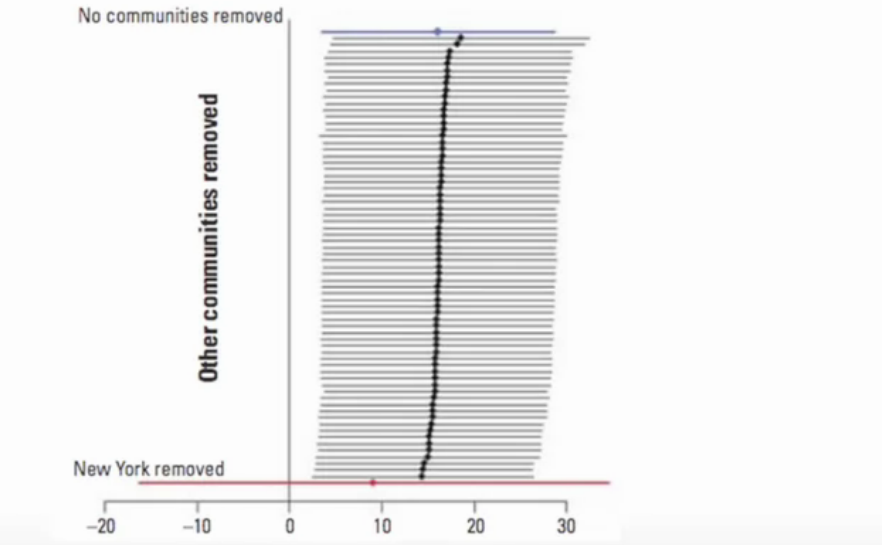

```{r setup, include=FALSE}
knitr::opts_chunk$set(echo = TRUE)
```

# Intro  
* Reproducible Research applies to data analysis but also any sort of processing of data to help convey what has been done to the data so an analyis can be reproduced in the future.  
* This course will cover the tools one can use in R to communicate what one has done with the data  

## Course Description  
* "**In this course you will learn the ideas of reproducible research and reporting of statistical analyses. Topics covered include literate programming tools, evidence-based data analysis, and organizing data analyses. In this course you will learn to write a document using R markdown, integrate live R code into a literate statistical program, compile R markdown documents using knitr and related tools, publish reproducible documents to the web, and organize a data analysis so that it is reproducible and accessible to others.**"  

## Course Book  
**(The book can be downloaded as a pdf from leanpub)[https://leanpub.com/reportwriting]**  

## What is Reproduciblity about?
* Peng makes an analogy between data science and music, he compares two songs:
        + **(Code Monkey)[https://www.youtube.com/watch?v=qYodWEKCuGg]**  
        + **(Symphony No. 8)[https://www.youtube.com/watch?v=e7WgXhUBrps]**
* The second song is quite complex, it's even been nicknamed "Symphony of a Thousand" for the amount of people required to perform it. The score that comes with it gives detailed information of what every section is to be doing during the piece. 
* In addition, *Mahler* was a conducter and often felt frustrated with scores that had complex parts but didn't convey enough information about what the composer wanted. So when he wrote his music he wrote detailed instructions with the score.
* In Data analysis there is no one unified way that the "score" of a data analysis is conveyed. As such everyone has thier own way from describing what was done to providing all the code. The first can sometimes be lacking and the second can seem to be an information overload.  


# Concepts, Ideas, & Structure  
## Concepts and Ideas (Part 1)  
### Replication  
* The ulitimate standard for strengthening scientific evidence is replication of findings and conducting studies with independent:
        + Investigators  
        + Data  
        + Analytical methods  
        + Laboratories  
        + Instruments  
* Replication is particularly important in studies that can impact broad policy or regulatory decisions  

**However**,
* Some studies cannot/can be challenging to be replicated  
        + No time, studies nowadays require large sample sizes  
        + No money, researchers gotta eat too  
        + Unique, sometimes a study is of a particular subset (Air Pollution, 'rona)  
* Reproducible Research makes analytic data and code available so that others may reproduce findgs; a middle ground between replication and nothing  

### Why Do We Need Reproducible Research?  
* New technologies increasing data collection throughput; data are more complex and extremely high dimensional  
* Existing data bases can be merged into new "megadatabases"  
* Computing power is greatly increased, allowing more sophisticated analyses  
        + Kinda like using DNA evidence for old cold cases  
* For every field "X" there is a field "Computational X"  
        + Reproducing the Computational X from the X will allows others to be confident the correct analysis was done  

### Example: Reproducible Air Pollution and Health Research  
* Estimating small (but important) health effects in the presence of much stronger signals  
        + Air pollution lightly impacts health but still effects it enough.. on occasion  
* Results inform substantial policy decisions, affect many stakeholders  
        + EPA regulations can cost billions of dollars, so the research must be reproducible to convey the reason for the need of these new regulations  
* Complex statistical methods are needed and subjected to intense scrutiny  
* See Also: Internet-based Health and Air Pollution Surveillance System (iHAPSS)  

## Concepts and Ideas (Part 2)  
### Research Pipeline  
* When you read an article you only get the article, not the data that are behind it.  
* This is where the research pipeline comes in..  
  
  
### Recent Developments in Reproducible Research  
**(The Duke Saga)[https://www.youtube.com/watch?v=eV9dcAGaVU8&feature=emb_err_watch_on_yt]**  
**(Evolution of Translational Omics: Lessons Learned and the Path Forward)[https://www.nap.edu/catalog/13297/evolution-of-translational-omics-lessons-learned-and-the-path-forward]**  
* In the Discovery/Test Validation stage of omics-based tests:  
        + **Data/metadata** used to develop test should be made publicly available  
        + The **computer code** and fully specified computational procedures used for development of the candidate omics-based test should be made sustainably available  
        + "Ideally, the computer code that is released will **encompass all of the steps of computational analysis**, including all data preprocessing steps, that have been described in this chapter. All aspects of the analysis need to be transparently reported."  
        
### What do We Need for Reproducible Research?
* Analytic data are available  
* Analytic code are available  
* Documentation of code and data  
* Standard means of distribution  

Who are the Players:
* Authors  
        + Want to make their research reproducible  
        + Want tools for RR to make their lives easier (or at least not much harder)  
* Readers  
        + Want to reproduce (and perhaps expand upon) interesting findings  
        + Want tools for RR to make their lives easier  
        
### Challenges  
* Authors must undertake considerable effor to put data/results on the web (may not have resources like a web server)  
* Readers must download data/results individually and piece together which data go with which code sections, etc.  
* Readers may not have the same resources as authors  
* Few tools to help authors/readers (although toolbox is growing!)  

In Reality...  
* Authors
        + Just put stuff on the web  
        + (Infamous) Journal supplementary materials skewed about  
        + There are some central databases for various fields (e.g. biology, ICPSR)  
* Readers  
        + Just download the data and (try to) figure it out  
        + Piece together the software and run it  


## Concepts and Ideas (Part 3)  
### Literate (Statistical) Programming  
* An article is a stream of **text** and **code**  
* Analysis code si divided into text and code "chunks"  
* Each code chunk loads data and computes results  
* Presentation code formats results (tables, figures, etc.)  
* Article text explains what is going on  
* Literate programs can be **weaved** to produce human-readable documents and **tangled** to produce machine-readable documents  

* Literate programming is a general concept that requires:  
1) A documentation language (human readable)  
2) A programing language (machine readable)  

### Sweave  
* Pronounced S-weave
* Uses L[A]T_E_X (Pretend that worked) and R as the documentation and programming languages  
* Sweave was developed by Friedrich Leisch (member of the R Core) and is maintained by R core  
* **[Website](http://www.statistik.lmu.de/~leisch/Sweave)**  

Limitations:
* Focused primarily on LaTeX, a difficult to learn markup language used "only by weirdos"  
* Lacks features like caching, multiple plots per chunk, mixing programming languages and many other technical items  
* Not frequently updated or very actively developed  

### knitr  
* knitr si an alternative (more recent) package  
* Brings together many features added on to Sweave to address limitations  
* knitr uses R as the programming language (although others are allowed) and variety of documentation languages  
        + LaTeX, Markdown, HTML  
* knitr was developed by Yihui Xie (while a graduate student in statistics at Iowa State)  
* **[Website](http://yihui.name/knitr/)**  

**Reminder to commit, delete this line** ***AFTER*** **committing**  

### Summary  
* Reproducible research is important as a **minimum standard**, particularly for studies that are difficult to replicate  
* Infrastructure is needed for **creating** and **distributing** reproducible documents, beyhond what is currently available  
* There is a growing number of tools for creating reproducible documents  

## Scipting Your Analysis  
* Scripting everything helps make your work as reproducible as possible  
* In the past one may have written everything down in a lab notebook, but now with computers we document everything with scripts in computers  
* To make an analogy to music, the final paper/presentation is like the melody, but the exploratory work is like the supporting instruments in a song  
* Simular to a score in music we need a way to document everything that's going on in an analysis, this is the script  


## Structure of a Data Analysis (Part 1): Defining to Cleaning  
* General steps in a data analysis:
  + Define the question  
  + Define the ideal data set  
  + Determine what data you can access  
  + Obtain the data  
  + Clean the data  
  + Exploratory data analysis  
  + Statistical prediciton/modeling  
  + Interpret results  
  + Challenge results  
  + Synthesize/write up results  
  + Create reproducible code  
  
"*Ask yourselves, what problem have you solved, ever, that was worth solving, where you knew all fo the given information in advance? Where you* ***didn't*** *have a surplus of information and have to filter it out, or you had insufficent information and have to go find some?*" - Dan Myer, Maths Educator; **[TED talk "Math class needs a makeover"](https://www.youtube.com/watch?v=qocAoN4jNwc)**  

* A lot of the process of data analysis is filtering through all the information  

### Defining a question  
* The more effort you can put into coming up with a reasonable question, the less effort you'll have to spend sorting through a lot of stuff; most powerful dimension reduction tool you can employ.
* Narrowing down question will reduce potential noise in a large data set  
* The science will determine the question, leading to the data, leading to the applied statistics, from here one could develop theoretical statistics should their skill allow  
* The applied statistics have to be thoruhgly thought through to use the appropriate methods to make some conclusion  

An example:
* Start with a general question  
  + Can I automatically detect emails that are SPAM and those that are not?
(Side Note: SPAM email comes from a reference to **[this Monty Python sketch](https://vimeo.com/329001211)**, as such legit email is classified as "HAM")  

* Make it concrete  
  + Can I use quantitative characteristics of the emails to classify them as SPAM/HAM?  
  
### Define the ideal data set  
* The data set may depend on your goal  
  + Descriptive - a whole population  
    - Ex: All of the emails in the universe  
  + Exploratory - a random sample with many variables measured  
  + Inferential - the right population, randomly sampled  
    - Have to be careful of the sampling mechanism and the population you're drawing from  
  + Predictive - a training and test data set from the same population  
  + Causal - data from a randomized study  
    - "If I modify this compenet, something else will happen  
  + Mechanistic - data about all components of the system  
  
Our example:  
* One could get all the emails **[from googles datacenter](http://www.google.com/about/datacenters/inside)**

### Determine what data you can access  
* Sometimes you can find data free on the web  
* other times you may need to buy the data  
* Be sure to respect the terms of use  
* If the data don't exist, you may need to generate it yourself  

Our example:  
* Google's data center security is quite high and getting *everyone's* emails would be releasing some personal information so we'll probably have to go with something else, **[since Google isn't evil](https://en.wikipedia.org/wiki/Don't_be_evil)**  

* A possible solution is to use **[the Spambase dataset](http://archive.ics.uci.edu/ml/datasets/Spambase)**  


### Obtain the data  
* Try to obtain the raw data  
* Be sure to reference the source  
* Polite emails go a long way if you need data from someone  
* If you will load the data from an internet source, record the url and time accessed  
  
**(Data set for our example comes with the kernlab package.)[http://search.r-project.org/library/kernlab/html/spam.html]** How the data was previously processed is also documented in that link.  

### Clean the data  
* Raw data often needs to be processed  
* If it is pre-processed, make sure you understand how  
* Understand the source of the data (sensus, sample, convenience sample, etc.)  
* May need reformating, subsampling - record these steps so they can be reproduced  
* **Determine if the data are good enough** - if not, quit or change data  

Out cleaned data set  
```{r}
library(kernlab)
data(spam)
str(spam[, 1:5])
```


## Structure of a Data Analysis (Part 2): Exploring to Creating Reproducible Code  
### Subsampling our data into test & train sets  
```{r}
library(kernlab)
data(spam)
set.seed(3435)
trainIndicator <- rbinom(nrow(spam), size = 1, prob = 0.5)
table(trainIndicator)
trainSpam <- spam[trainIndicator == 1, ]
testSpam <-  spam[trainIndicator == 0, ]
```

### Exploratory data analysis  
* Look at summaries of the data  
* Check for missing data  
* Create exploratory plots  
* Perform exploratory analyses (e.g. clustering)  

```{r}
#Checkin' out data
names(trainSpam)
head(trainSpam) #freq of words in emails
```

```{r}
#Look at some plots
plot(trainSpam$capitalAve ~ trainSpam$type)#Avg capital letters
#Data is hard to see so looking at the log will help
plot(log10(trainSpam$capitalAve + 1) ~ trainSpam$type) 
# add 1 to evaluate 0s - ok for exploring, not reports
```
* The second plot helps us see the freq of capitals in spam is higher than in nonspam  

Relationships between predictors:  
```{r}
plot(log10(trainSpam[, 1:4] + 1))
```
* Words in the diagonal tell what predictor those respective rows & cols are looking at  
  + Referred to as a "Paris plot"  
  
Clustering:  
```{r}
hCluster = hclust(dist(t(trainSpam[, 1:57])))
plot(hCluster)
```
* not very informative since info is skewed, so clustering a log might give a better insight  

```{r}
hClusterUpdated <- hclust(dist(t(log10(trainSpam[, 1:55] + 1))))
plot(hClusterUpdated)
```

### Statistical prediction/modeling  
* Should be informed by the sefults of your exploratory analysis  
* Exact methods depend on the question of interest  
* Transformations/processing should be accounted for when necessary  
* Measures of uncertainty should be reported  
Example:  
```{r echo = TRUE, include = FALSE}
# Use a logistic regression to determine which variable has the min  
# error from the regression
trainSpam$numType <- as.numeric(trainSpam$type) - 1
costFunction = function(x, y) sum(x != (y > 0.5))
cvError = rep(NA, 55)
library(boot)

for (i in 1:55) {
  lmFormula = reformulate(names(trainSpam)[i], response = "numType")
  glmFit = glm(lmFormula, family = "binomial", data = trainSpam)
  cvError[i] = cv.glm(trainSpam, glmFit, costFunction, 2)$delta[2]
}
#The above loop was causing a spew of warnings so I segmented the parts that
#include output to hide these warnings

```
```{r}
#Which predictor has minimum cross-validated error?
names(trainSpam)[which.min(cvError)]
```

Get a measure of uncertainty  
```{r}
## Use the best model from the group
predictionModel = glm(numType ~ charDollar, 
                      family = "binomial", data = trainSpam)

## Get predictions on the test set
predictionTest = predict(predictionModel, testSpam)
predictedSpam = rep("nonspam", dim(testSpam)[1])

## Arb. Classify as 'spam' for those with prob > 0.5
predictedSpam[predictionModel$fitted > 0.5] = "spam"
head(predictedSpam)
```

Get a measure of uncertainty  
```{r}
## Classification table
result <- table(predictedSpam, testSpam$type)
result
## Error rate
errors <- result[1,2] + result[2,1]
total <- sum(result[1:2,1:2])
print(paste0(errors, " errors occured out of ", 
      total, " readings resulting in an error rate of ",
      round(errors/total, 4)))
```

### Interpret results  
* Use the appropriate language  
  + "describes"  
  + "correlates with/associated with"  
  + "leads to/causes"  
  + "predicts"  
* Give an explanation  
* Interpret coefficients  
* Interpret measures of uncertainty  

In our example:
* The fraction of chacters that are dollar signs can be used to predict if an email is Spam  
* Anything with more than 6.6% dollar signs is classified as Spam  
* More dollar signs always means more Spam under our prediction  
* Our test set error rate was 22.4%

### Challenge Results  
* Challenge all steps:
  + Question  
  + Data source  
  + Processing  
  + Analysis  
  + Conclusions  
* Challenge measures of uncertainty  
* Challenge choices of terms to include in models  
* Think of potential alternative analyses  

### Synthesize/write-up results  
* Lead with the question  
* Summarize the analyses into the story  
* Don't include every analysis, include it:  
  + If it is needed for the story  
  + If it is needed to address a challenge  
* Order analyses according to the story, rather than chronologically  
* Include "pretty" figures that contribute to the story  

In our example:
* Lead with the question  
  + "*Can I use quantitative characteristics of the emails to classify them as SPAM/HAM?*"  
* Describe the approach  
  + Collected data from UCI -> created training/test sets  
  + Explored relationships  
  + Choose logistic model on training set by cross validation  
  + Applied to test, 78% test set accuracy  
* Interpret results  
  + Number of dollar signs seems reasonable, e.g. "Make money with Viagra \$ \$ \$ \$!"
* Challenge results  
  + 78% isn't that great  
  + I could use more variables  
  + Why logistic regression?
  


## Organizing Your Analysis  
* No universal way for every data analysis, however this lecture aims to give some useful tips  

### Types of Data Analysis Files  
* Data  
  + Raw data  
  + Processed data  
* Figures  
  + Exploratory figures - not very polished  
  + Final figures  
* R code  
  + Raw / unused scripts  
  + Final scripts - easier to read, commented  
  + R Markdown files  
* Text  
  + README files  
  + Text of analysis / report  
  
### Raw Data  
* Should be stored in your analysis folder  
* If accessed fromt he web, include url, description, and date accessed in README  
* Adding raw data to Git repo is good, however sometimes these files are too large to be stored on GitHub  

### Processed Data  
* Processed data should be named files so it is easy to see which script generated the data  
* The processing script - processed data mapping should occur in the README  
* Processed data should be **tidy**  

### Exploratory Figures  
* Figures made during the course of your analysis, not necessarily part of your final report  
* They do not need to be "pretty"  

### Final Figures  
* Usually a small subset of the original, exploratory figures  
* Axes/colors set to make the figure clear  
* Possibly multiple panels (helps to condence related info)  
* Labeled well and annotated to help readers understand what's going on with the data  

### Raw Scripts  
* May be less commented (although comments do help you)  
* May be multiple versions  
* May include analyses that are later discarded since they lead to a dead-end  

### Final Scripts  
* Clearly commented  
  + Small comments liberally - aim to answer the "what, when, why, and how"s  
  + Bigger commented blocks for whole sections of code  
* Include processing details  
* Only analyses that appear in the final write-up, helps others view the process and reproduce  

### R Markdown Files  
*(Is this where I say something about all these notes being in R Markdown?)*  
* R markdown files (`.Rmd`) can be used to generate repoducible reports  
* Text and R code are integrated in one document  
* Very easy to create in `Rstudio`  

### README files  
* Explain what's going on in the directory  
* Not necessary if you use R markdown files, as those ussually will be stating what's going on as code is executed  
* Should contain step-by-step instructions for analysis  
* **[Here is an example](https://github.com/jtleek/swfdr/blob/master/README.md)**  

### Text of the document  
* It should include a title, introduction (motivation), methods (statistics you used), results (including measures of uncertainty), and conclusions (including potential problems)  
* It should tell a story  
* *It should not include every analysis you performed*  
* References should be incldued for statistical methods  

### Further Resources  
* Information about a non-reproducible study that led to cancer patients being mistreated: **[The Duke Saga Starter Set](http://simplystatistics.org/2012/02/27/the-duke-saga-starter-set/)**  
* **[Reproducible research and Biostatistics](http://biostatistics.oxfordjournals.org/content/10/3/405.full)**  
* **[Managing a statistical analysis project guidelines and best practices](http://www.r-statistics.com/2010/09/managing-a-statistical-analysis-project-guidelines-and-best-practices/)**  
* **[Project template](http://projecttemplate.net/)** - a pre-organized set of files for data analysis


# Markdown & knitr  
## Coding Standards in R  
* Help make code readable so both you and others can read what your code does  
* Just like any other style, such as clothing, not everyone will agree on the basic ideas but this lecture will cover some of the standards  

1) Save code as text files  
* Easily interpertable by all devices  
* RStudio does this by default  

2) Indent your code  
* Separates sections of code, such as loops & functions  
* Amount a tab width is is up for debate, but old-schoolers like a width of 8, but a width of 4 is considered a minimum  

3) Limit the width of your code  
* 80 columns is standard  
* Code can be concisely viewed without annoying horizontal scrolling  
* Also helps avoid issues with code readability when combined with indenting standards, a 4 nested for loop will start hitting the right margin  

4) Limit the length of individual functions  
* Each data should do one basic activity
  + `readData(filename)` should just read the data and return the data.table  
  + `readData(filename)` should **NOT** read, process, fit a model, and print some output  
* Nice to have a function written on a single page of the code to be able to evaluate what it does  
* Helps with finding bugs within a function  


## Markdown  
* Simplified markup language  
* Easy to integrate with R Code and other programming languages  

"*Markdown is a text-to-HTML conversion tool for web writers. Markdown allows you to write using an easy-to-read, easy-to-write plain text format, then convert it to structurally valid XHTML (or HTML).*" - John Gruber, creator of Markdown  

### Syntax  
* Italics  
  + \*This text will appear italicized\*   
  + *This text will appear italicized*  

* Bold  
  + \*\*This text will appear bold!\*\*  
  + **This text will appear bold!**  

* Italics & Bold  
  + \*\*\*This text will appear both italicized & bold\*\*\*  
  + ***This text will appear both italicized & bold***  
  
* Headings  
  + \#\# This is a secondary heading  
  + \#\#\# This is a tertiary heading
  + (Example has been ommitted as to not mess up TOC)  
  
* Unordered Lists
  + Character doesn't matter, as long as it's consist  
  + \* I use this for first bullet(Line above)  
  + \+ These for second bullet(This line)  
  + \- These for a third bullet
    - Third Bullet  
    
* Ordered Lists  
  + 1) first item  
  + 2) second item  
  + 3) third item  
  1) first item  
  2) second item  
  3) third item  
  + If you want to add something it just has to be a number followed by the same character, then markdown will order the numbers when it executes based on the inital number    
  1. What if I like periods instead  
  34. I forgot to add this line earlier and it starts with "`34.`"  
  2. Yeah that's fine just use those  
  3. Whatever you type shows up as is  
  
* Links (Ignore the `\` characters)  
  + \\[Johns Hopkin Bloomberg School of Public Health\\]\\(http://www.jhsph.edu/ \\)  
  + [Johns Hopkin Bloomberg School of Public Health](http://www.jhsph.edu/)  
  + Underline isn't supported in pdfs so I developed the tecnique of bolding links
    - \*\*\\[Download R\\]\\(http://www.r-project.org/ \\)\*\*  
    - **[Download R](http://www.r-project.org/)**  

* Newlines require two spaces  

## R Markdown  
### What is Markdown?  
* Created by John Gruber and Aaron Swartz  
* A simplified version of "markup" languages  
* Allows one to focus on writing as opposed to formatting  
* Simple/minimal intuitive formatting elements  
* Easily converted to valid HTML (and other formats) using existing tools  
* Complete information is available at **[this site](http://daringfireball.net/projects/markdown/)**  
* **[Some background information](http://daringfireball.net/2004/03/dive_into_markdown)**  

### What is R Markdown?  
* R markdown is the integration of R code with markdown  
* Allows one to create documents containing "live" R code  
* R code is evaluated as part of the processing of the markdown  
* Results from R code are inserted into markdown document  
* A core tool in *literate statistical programming*  
* R markdown can be converted to standard markdown using the `knitr` package in R  
* Markdown can be converted to HTML using the `markdown` package in R  
* Any basic text editor can be used to create a markdown document; no special editing tools are needed  
* The R markdown --> markdown --> HTML 
* Work flow can be easily managed using RStudio (but not required)  
* Slides can be written in R markdown and converted using the `slidify` package  


## R Markdown Demo  
This entire thing is made in R Markdown so just look at that related code for a demo.  


## knitr (Part 1)  
* Helps make analysis reproducible through literate statistical programming  
  
The problems that `knitr` aims to solve  
* Authors must undertake considerable effor to put data/results on the web  
* Readers must download data/results individually and piece together which data go with whcih code sections, etc.  
* Authors/readers must manually interact with websites  
* There is no single document to integrate data snalysis with textual representations; i. e. data, code, and text are not linked  

### Literate Statistical Programming  
* Literate Programming orginally came from Don Knuth  
* An article is to be a stream of **text** and **code**  
* Analysis code is divided into text and code "chunks"  
* Presentation code formats results (tables, figures, etc.)  
* Article text explains what is going on in the code sections  
* Literate programs are **weaved** to produced human-readable documents and **tangled** to produce machine-readable documents  
* Literate programming as a general concept needs:  
  + A documentation language  
  + A programming language  
* The original **Sweave** system developed by Friedrich Leisch used LaTeX and R  
* **knitr** supports a variety of documentation languages  

### How do I Make My Work Reproducible?  
* Decide to do it (ideally from the start)  
  + Deciding at the end requries a lot of backtracking and reformatting  
* Keep track fo things, perhaps with a version control system to track snapshots/changes  
* Use software whose operation can be coded  
  + This usually rules out and GUI software, unless it tracks what you click on  
* Don't save output  
  + Don't preprocess data and only keep clean data, as you won't have a record of how you created the clean data  
* Save data in non-proprietary formats  
  + formats where the layout of the data isn't publiclly known  
  + makes difficult for others to access the data  

### Pros and Cons  
Pros  
* Text and code are all in once place, in a logical order  
* Data and results are automatically updated to reflect external changes  
* Code is live/automatic when building a document. Helps you know if an error in the analysis has appeared  

Cons  
* Text and code all in one place; can make documents difficult to read, especially if there is a **lot** of code  
* Can substantially slow down processing of documents (although there are tools to help)  

## knitr (Part 2)  
### What is knitr?  
* An R package written by Yihui Xie (while he was a grad student at Iowa State)  
  + Available on CRAN  
  + Built into RStudio  
* Supports RMarkdown, LaTeX, and HTML as documentation languages  
* Can export to PDF, HTML  
* Built right into RStudio for your convenience  
Requirements  
* A recent version of R  
* A text editor (the one that comes with RStudio is fine)  
* Some support packages also available on CRAN  
  + auto downloaded with `install.package()` function
* Some knowledge of Markdown, LaTeX, or HTML  

### What is knitr Good For?  
* Manuals  
* Short/medium-length technical documents  
* Tutorials  
* Reports (esp. if generated periodically)  
* Data preprocessing documents/summaries  

What it's not good for  
* Very long research articles  
  + Hard to edit  
* Complex, time-consuming computations  
  + has to rerun everytime you generate the document  
* Documents that require precise formatting


## knitr (Part 3)  
This lecture covers how to make a knitr document  
* Create a R Markdown document  
* Right up Rmd code you want to use to generate the document  
* Hit `Knit` in RStudio  
* If not in RStudio:
```{r eval = FALSE}
library(knitr)
setwd(<working directory>)
knit2html("document.Rmd")
browseURL("document.html")
```

### A few notes  
* knitr will fill a new document with filler text; normally you just want to delete this  
* Code chucks begin with \`\`\`{r} and end with \`\`\`  
  + All R code goes in between these markers  
* Code chunks can have **names**, which is useful when we start making graphics  
\`\`\`{r firstchunk}  
\#\# R code goes here  
\`\`\`
* By default, code in a code chunk is echoed, as will the results of the computation (if there are results to print)  

## knitr (Part 4)  
### Processing of knitr Documents  
#### (What happens under the hood)  
* You write the RMarkdown document (`.Rmd`)  
* knitr produces a Markdown document (`.md`)  
* knitr converts the Markdown document into HTML (by default)  
* You should **NOT** edit (or save) the `.md` or `.html` documents until you are finished  

### Inline Text Computations  
```{r}
time <- format(Sys.time(), "%a %b %d %X %Y")  
rand <- rnorm(1)
```
* You can integrate values of object into a sentance by using *the grave key* followed by `r` to call to that object.  
  + The current time is `r time`. A random number is `r rand`.  
  
### Some calls to add in the begining of a code chunk: {r ..., ...}  
* `echo` - Logical indicating if code should appear in output doc  
* `results` - Options: 
  + `"markup"`- default  
  + `"asis"` - (as is) passthrough results, helpful for showing nice tables  
```{r results = "asis"}
library(datasets)
data(airquality)
fit <- lm(Ozone ~ Wind + Temp + Solar.R, data = airquality)

library(xtable)
xt <- xtable(summary(fit))
print(xt, type = "html")
```
  
  + `"hide"` - do not display results  
  + `"hold"` - put all results below all code  
* `warning` - logical indicating if warnings should appear in doc  
* `eval` - logical indicating if code should be ran  
* `fig.` - `height` & `width` will adjust the respective dimensions  
  + for figures knitr will encode the image in HTML, so it is embedded in the actual HTML file  
* `cache` - Logical indicating if results of computation should be cached
  + Helpful if a code chunk takes a long time to run  
  + If set to `TRUE`, after the first run results are loaded from the cache rather than being re-computed every time; if nothing has changed in the chunk  
  + `FALSE` by default  
  + Dependencies are not checked explicitly, so if one code chunk depends on results from a previous and the previous is changed the old output will still be recalled from the cache  
  + Chunks with significant *side effects* may not be cacheable, that is an effect outside the document  
  
### Setting Global Options  
* Sometimes we want to set options for **every** code chunk that are different from the defaults  
* For example, we may want to suppress all code echoing and results output  
* we do this with `opts_chunk$set(<put new defaults in here>)`

# Course Project 1  
**[My project can be found on GitHub](https://github.com/PhiPrime/Activity_Data_Report_Proj_1)**


# Reproducible Research Checklist & Evidence-based Data Analysis  
## Communicating Results  
TL;DR  
* People are busy, expecially managers and leaders  
* Results of data analyses are sometimes presented in oral form, but often the first cut is presented via email  
* It is often useful to breakdown the sefults of an analysis into different levels of granularity/detail  
* **[On getting responses from busy people](https://simplystatistics.org/2011/09/23/getting-email-responses-from-busy-people/)**  

### Hierarchy of Information: Research Paper  
* Title/Author list - Subject  
* Abstract - motivation & bottom line  
* Body / Results - methods, details on what was done  
* Supplementary Materials / the gory details  
* Code / Data / really gory details  

### Hierarchy of Information: Email Presentation  
* Subject line / Sender info  
  + At a minimum; include one  
  + Can you summarize findings in one sentace?  
* Email body  
  + A brief description of the problem / context; recall what was proposed and executed previously; summarize findings / results; 1-2 paragraphs  
  + If action needs to be taken as a result of this presentation, suggest some options and make them as concete as possible.  
  + If questions need to be addressed, try to make them yes / no  
* Attachment(s)  
  + R Markdown file  
  + knitr report  
  + Stay concise; don't spit out pages of code (because you used knir we know it's available)  
* Links to Supplementary Materials  
  + Code / Software / Data  
  + GitHub repository / Project web site  

## RPubs  
* Website that is supported by RStudio  
* Can be used to publish markdown or knitr documents to share with others & the public  
* Once you create an account you can publish to RPubs  

### Publishing  
* Go to a knitr document and preview the HTML
* There is an icon to Publish on the top of the pop-up window  
* After selecting publish it will pull up the RPubs page  
  + Fill out requested info and publish  
* After you publish people can view & comment on it
* Everything is always public on RPubs  
  + Published documents can be deleted if they shouldn't have been made public  

## Reproducible Research Checklist (Part 1)  
### DO: Start With Good Science  
* Garbage in, garbage out  
  + If you start with something you like are intrested in you'll be motivated to produce a well explained document as results  
* Coherent, focused question simplifies many problems  
* Working with good collaborators reinforces good practices  
* Something that's interesting to you will (hopefully) motivate good habits  

### DON'T: Do Things By Hand  
* Editing spreadsheets of data to "clean it up"  
  + Removing outliers  
  + QA / QC (Quality Assurance/Control)
  + Validating 
* Editing tables of figures (e.g. rounding, formatting)  
* Downloading data from a web site (clicking links in a web browser)  
  + Ye' gotta use your hand to touch that mouse, right?  
* Moving data around your computer; splitting / reformatting data files  
* "We're just going to do this once..." (e.g. downloading the data set)  
* Things done by hand need to be precisely documented (this is harder than it sounds)  

### DON'T: Point and Click  
* Many data processing / statistical analysis packages have graphical user interfaces (GUIs)  
* GUIs are convenient / intuitive but the action you take witha  GUI can be difficult for others to reproduce  
* Some GUIs produce a log file or script which includes equivalent commands; these can be save for later examination  
* In general, be careful with data analysis software that is highly *interactive*; each of use can sometimes lead to non-reproducible analyses  
* Other interactive software, such as text editors, are usually fine  

## Reproducible Research Checklist (Part 2)
### DO: Teach a Computer  
* If something needs to be done as part of your analysis / investigation, try to teach your computer to do it (even fi you only need to do it once)  
* In order to give your computer instructions, you need to write down exactly what you mean to do and how it should be done  
* Teaching a computer almost guarantees reproducibilty  

For example, by hand, you can:
1) Go to the **[UCI Machine Learning Repository](http://archive.ics.uci.edu/ml/)**  
2) Download the *Bike Sharing Dataset* by clicking on the link to the Data Folder, then clicking on the link tot he zip file of dataset, and choosing "Save Linked File As..." and then saving it to a folder on your computer  

But this list is could be taught to a machine with the following code in `R`  
```{r eval = FALSE}
download.file("http://archive.ics.uci.edu/ml/machine-learning-databases/00275/Bike-Sharing-Dataset.zip", "ProjectData/Bike-Sharing-Dataset.zip")
```

Notice here that  
* The full URL to the dataset file is specified (no clicking thorugh a series of links)  
* The name of the files saved to your local computer is specified  
* The directory in which the file was saved is specified("ProjectData")  
* Code can always be executed in R (as long as link is available)  
* However, if the link for the website were to go down the code would become obsolete  

### Do: Use Some Version Control  
* Slow things down  
  + Helps one keep track of what changes have been made  
  + Make the process more step-by-step  
* Add changes in small chunks (don't just do one massive commit)  
* Track / tag snapshots; revert to old versions  
* Software like *GitHub* / BitBucket (Also accepts Git) / SourceForge make it easy to publish results  

### Do: Keep Track of Your Software Environment  
* If you work on a complex project involving many tools / datasets, the software and computing environment can be critical for reproducing your analysis. Not all of these are critical depending on the project you're working on.  
* **Computer architecture**: CPU (Intel, AMD, ARM), GPUs, 32/64-bit
* **Operating system**: Windows, Mac OS, Linux  
* **Software toolchain**: Compilers, interpreters, command shell, programming languages (C, Perl, Python, etc.), database backends, data analysis software  
* **Sipporting software / infrastructure**: Libraries, R packages, dependecies  
* **External dependencies**: Web sites, data repositories, remote databases, software repositories  
* **Version numbers**: Ideally, for everything (if available)  

* One can use `sessionInfo()` to get a lot of this information  
```{r}
sessionInfo()
```


## Reproducible Research Checklist (Part 3)  
### DON'T: Save Output (Until the very end)  
* Avoid saving data analysis output (tables, figures, summaries, processed data, etc.), except perhaps temporarily for efficiency purposes  
* If a stray output file cannot be easily connected by the means by which it was created, then it is not reproducible.  
* Save the data & code that generated the output, rather than the output itself  
  + don't multiply `0.66667` by `3`, multiply `2/3` by `3`  
* Intermediate files are okay as long as there is clear documentation of how they were created  

### DO: Set Your Seed  
* Random number generators generate pseudo-random numbers based on an inital seed (usually a number or set of numbers)
  + In R you can use the `set.seed()` function to set the seed and to specify the random number generator to use  
    - This is your chance to use Phi primes all the time!  

* Setting the seed allows for the stream fo random numbers to be exactly reproducible  
* Whenever you generate random numbers for a non-trivial purpose, **always set the seed**  

### DO: Think About the Entire Pipeline  
* Data analysis is a lengthy process; it is not just tables / figures / reports  
* Raw data -> processed data -> analysis -> report  
* How you got to the end is just as important as the end itself  
* The more of the data analysis pipeline you can make reproducible, the better for everyone  

### Summary: Questions to ask Yourself
* Are we doing good science?  
* Was any part of this analysis done by hand?  
  + If so, are those part *precisely* documented?  
  + Does the documentation match reality?  
* Have we taught a computer to do as much as possible (i. e. coded)?  
* Are we using a version control system?  
* Have we documented out software environment?  
* Have we saved any output that we cannot reconstruct from original data + code?  
* How far back in the analysis pipeline can we go before our results are no longer (automatically) reproducible?  

## Evidence-based Data Analysis (Part 1)  
### Replication and Reproducibility  
Replication  
* Focuses on the validity of the scientific claim  
* "Is this claim true?"  
* The ultimate standard for strengthening scientific evidence  
  + Succesful repelication backs it
  + Multiple failed replications invalidate the orginal claim  
* New investigators, data, analytical methods, laboratories, instuments, etc.  
* Particularly important in studies that can impact broad policy or regulatory decisions  

Reproducibility  
* Focuses on the validity of the data analysis  
* "Can we trust this analysis?"  
* Arguably a minimum standard for any scientific study  
* New investigators, same data, same methods  
* Important when replication is impossible  

### Background and Underlying Trends  
* Some studies cannot be replciated: No time, No money, Unique/opportunistic  
* Technology is increasing data collection throughput; data are mroe complex and high-dimensional  
* Existing databases can be merged to become bigger databases (but data are used off-label; admin databases used for health studies)  
* Computing power allows more sophisticated analyses, even on "small" data  
* For every field "X" there is a "Computational X"  

### The Result of These Trends
* Even basic analyses are difficult to describe  
* Heavy computational requriements are thrust upon people without adequate training in statistics and computing  
* Errors are mroe easily introduced into long analysis pipelines  
* Knowledge transfer is inhibited  
* Results are difficult to replicate or reproduce  
* Complicated analyses cannot be trusted  


## Evidence-based Data Analysis (Part 2)  
The goal of reproducible research to clear up the gap between the raw, measured data and the reader. This is done by being more mopen about the *Processing code*, *Analytic Data* & *Code*, and *Computational Results*  
  
Reproducibility solves problems with:
* Transparency - all the code is avaliable if one wants to view it  
* Data Availability  
* Software / Methods Availability  
* Improved Transfer of Knowledge - get to see what they did, not guess  
* We do *NOT* get any benifits to Validity / Correctness of the analysis; Something can be totally wrong and reproducible  

### Problems with Reproducibility  
* The premise of reproducible research is that with data/code available, people can check each other and the whole system is self-correcting  
  + Addresses the most "downstream" aspect of the research process - post-publication  
  + Assumes everyone plays by the same rules and wants to achieve the same goals (i.e. Scientifc Discovery)  
  
## Evidence-based Data Analysis (Part 3)  
An Analogy from Asthma
* Allergen Exposure -> Specific IgE + sensitized mast cells -> Inflammatory mediators (i.e. histamines) -> Vasodilation, mucous (symptoms), bronchoconstriction
  + Medication can be applied in the last 3 sections, but not the first  
  + Reproducibility is like the medicine that treats the final symptom.  
* Research conducted -> Paper submitted to journal -> paper publication -> post-publication review  
  + Research can't be "Medicated"
  + Paper submitted to a journal recieves a "medication" of the editor's judgment  
  + When the paper is published, it recieves Peer reviews  
  + Post-publication is when reproduciblity can come to aide fellow researchers  
  
* The question remains if something can be done at the most "upstream" point of a study  
  + In Biostats some journals will give certain "badges" if the code and reproducible research is given with the submitted code

## Evidence-based Data Analysis (Part 4)  
### Who Reproduces Research  
* In order for reproducibility to be effective as a means to check validity, someone needs to do something  
  + Re-run the analysis; check results match  
  + Check the code for bugs/errors  
  + Try alternate approaches; check sensitivity  
* The need for someone to do something is inherited from the traditional notion of replication  
* Who is "someone" and what are their goals?  
  + Original Investigators - Truth is *A*  
  + General Public - Don't care  
  + Scientists - Truth is *A* or *B*; but often too busy to put to work in  
  + People who think the truth is just *not A* - often the ones that will reproduce the code to try to back their argument  

### Recap  
* Reproducibilty brings transparency (with code+data) and increased transfer of knowledge  
* A lot of discussion about how to get people to share data  
* Key question of "can we trust this analysis?" is not addressed by reproducibility  
* Reproducibility addresses potential problems long after they've occured ("downstream")  
* Secondary analyses are inevitably coloured by the interests/motivations of others  

### Evidence-Based Data Analysis  
* Most data analyses involve stringing together many different tools and methods  
* Some methods may be standard for a given field, but others are often applied ad hoc  
* We should apply thoroughly studied (via statistical research), mutually agreed upon methods to analyze data whenever possible  
* There should be evidence to justify the application fo a given method  
  


## Evidence-based Data Analysis (Part 5)  
### Evidence-Based Data Analysis  
* Create analytic pipelines from evidence-based components - standardize it  
* **[A Deterministic Statistical Machine](http://goo.gl/Qvlhuv)**  
  + Essentially aims to deter p-hacking  
* Once an evidence-based analytic pipeline is established, we shouldn't mess with it  
* Analysis with a "transparent box"  
  + Once a method is developed it isn't tinkered with  
* Reduce the "researcher degrees of freedom"  
  + Again, can promote p-Hacking  
* Analogous to a pre-specified clinical trial protocol  

### Case Study: Estimating Acute Effects of Ambient Air Pollution Exposure  
* Acute/short-term effect typically estimated via panel studies or time series studies  
* Work originated in late 1970s early 1980s  
* Key question: "Are short-term changes in pollution associated with short-term changes in a population health outcome?"  
* Studies usually conducted at community level  
* Long history of statistical research investigating proper methods of analysis  
  
Data is looking at mortality rates as they correlate with pm2.5 in some way  
* Can we encode everything that we have found in statistical/epidemiological research into a single package?  
* Time series studies do not have a huge range of variation; typically involves similar types of data and similar questions  
* We can create a deterministic statistical machine for this area?  

### DSM Modules for Time Series Studies of Air Pollution and Health  
1) Check for outliers, high leverage, overdispersion  
2) Fill in missing data? *NO!*   
3) Model selection: Estimate degrees of freedom to adjust for unmeasured confounders  
  * critical point of the model, multiple papers on it  
4) Multiple lag analysis  
5) Sensitivity analysis with  
  * Unmeasured confounder adjustment  
  * Influential points  
    + Both to look at how the model moves when these things are considered  
    
Where to go from here  
* One DSM is not enough, we need many  
* Different problems warrant different approaches and expertise  
* A curated library of machines providing state-of-the art analysis pipelines  
* A CRAN/CPAN/CTAN/... for data analysis  
* Or a "Cochrane Collaboration" for data analysis  
  + An archive of medicine that helps one see what medicine can be used for what issues.  
  
Possibly a curated library of Data Analysis  
* Provide packages that encode data anlyis pipelines for given problems, technologies, questions  
* Documentaion/references given supporting each module in the pipeline  
* Changes introduced after passing relevant benchmarks/unit tests  

### Summary  
* Reproducible research is important, but does not necessarily solve the critical question of whether a data analysis is trustworthy  
* Reproducible research focuses on the most "downstream" aspect of research dissemination  
* Evidence-based data analysis would provide standardized, best practices for given scientific area and questions  
* Gives reviewers an important tool without dramatically increasing the burden on them  
* More effort should be put into improving the quality of "upstream" aspects of scientific research  

# Case Studies & Commentaries  
## Caching Computations  
### Literate (Statistical) Programming  
* An article is a stream of **text** and **code**  
* Analysis code is divided into text and code "chunks"  
* Each code chunk loads data and computes results  
* Presentation code formats results (tables, figures, etc.)  
* Article text explains what is going on  
* Literate programs can be: 
  + **weaved** to produce human-readable documents; and 
  + **tangled** to produce machine-readable documents  
* Literate programming is a general concept that requires  
  1) A documentaion language (human readdable)  
  2) A programming language (machine readable)  
* Sweave uses LaTeX and R as the documentation and programming languages  
* Sweave was developed by Friedrich Leisch (member of the R Core) and is maintained by R core  
* Links:  
  + **[Wikipedia](http://www.statistik.lmu.de/~leisch/Sweave)**  
  + **[RStudio Support](https://support.rstudio.com/hc/en-us/articles/200552056-Using-Sweave-and-knitr)**  
* Alternatives to LaTeX/R exist, such as HTML/R (package R2HTML) and ODF/R (package odfWeave)  
* An idea proposed by Peng is to store the *Analytic Data* and *Computational Results* in a database for the reader  


* To store these results we want to cache them  

### The `cacher` package for R  
* Add-on package for R  
* Evaluates code written in fields and stores intermediate results in a key-value database  
* R expressions are given SHA-1 hash values so that changes can be tracked and code reevaluated if necessary  
  + SHA - Secure Hash Algorithm  
  + **[Wikipedia page on SHA-1](https://en.wikipedia.org/wiki/SHA-1)**   
  + **[Computerphile video on SHA-1](https://youtu.be/DMtFhACPnTY)**  
  + Changes are tracked by comparing new and stored hash values  
* "Cacher packages" can be built for distribution to public  
* Others can "clone" an analysis and evaluate subsets of code or inspect data objects depending on what part of the analysis they want to examine  
  
Using `cacher` as an Author  
1) Parse the R source file; Create the necessary cache directories and subdirectories  
2) Cycle through each expression in the source file:  
  + If an expression has never been evaluated, evaluate it and store any resulting R objects in the cache database  
  + If a cached result exists, lazy-load the results from the cache database and move to the next expression  
  + If an expression does not create any R objects (i.e., there is nothing to cache), add the expression to the list of expressions where evaluation needs to be forced  
  + Write out metadata for this expression to the metadata file.  
* The `cachepackage` function creates a `cacher` package storing  
  + Source file  
  + Cached data objects  
  + Metadata  
* Package file is zipped and can be distributed  
* Readers can unzip the file and immediately investigate its contents via `cacher` package  


### Using `cacher` as a Reader  
A journal article says:  
"*...the code and data for this analysis can be found in the cacher package 092dcc7dda4b93e42f23e038a60e1d44dbec7b3f.*"  

Note: `cacher` package is out-dated, I briefly looked for alternatives but didn't find anything. I'll just include the information for `cacher` anyway in case this proves useful at some point  
```{r eval = FALSE}
library(cacher)
clonecache(id = "092dcc7dda4b93e42f23e038a60e1d44dbec7b3f")
sourcefile("top20.R")
```

### Cloning an Analysis  
* Local directories created  
* Source code files and metadata are downloaded  
* Data objects are *not* downloaded by default (As they may be large)  
* References to data objects are loaded and corresponding data can be lazy-loaded on demand  


* `cacher` would use this list from `objectcode` to then create a graph showing how data was generated  

  
  
Running Code  
* The `runcode` function executes code in the source file  
* By default, expressions that results in an object being created are *not* run and the resulting objects are laxy-loaded into the workspace  
* Expressions not resulting in objects are evaluated  

Checking Code and Objects  
* The `checkcode` function evaluates all expressions from scratch (no lazy-loading)  
* Results of evaluation are checked against stored results to see if the results are the same as what the author calculated  
  + Setting RNG seeds is critical for this to work  
* The integrity of data objects can be verified with the `checkobjects` function to check for possible corruption of data (i.e. in transit)  


### `cacher` Summary  
* The `cacher` package *was able to* be used by authors to create cache pacckages from data analyses for distribution  
* Readers *were able to* use the `cacher` package to inspect others' data analyses by examining cached computations  
* `cacher` is mindful of readers' resources and efficiently loads only those data object that are needed

## Case Study: Air Pollution  
### What Causes Particulate Matter to be Toxic?  
* PM is composed of many different chemical elements  
* Some components of PM may be mroe harmful than others  
* Some sources of PM may be more dangerous than others  
* Identifying harmful chemical constituents may lead us to strategies for controlling sources of PM  

### National Morbidity, Mortality, and Air Pollution Study  
* The National Morbidity, Mortality, and Air Pollution Study (NMMAPS) was a national study of the short-term health effects of ambient air pollution  
* Focused primarily on particulate matter (PM~10~) and ozone (O~3~)  
* Health outcomes included mortality from all causes and hospitalizations for cardiovascular and respiratory diseases  
* Key publications  
  + **[Study](http://www.ncbi.nlm.nih.gov/pubmed/11098531)**
  + **[Study](http://www.ncbi.nlm.nih.gov/pubmed/11354823)**
* Funded by the **[Health Effects Institute](https://www.healtheffects.org/)**  
  + Roger Peng currently serves on the Health Effects Institute Health Review Committee  
  
Reproducibility of NMMAPS  
* Data made available at **[the Internet-based Health and Air Pollution Surveillance System](https://www.jhsph.edu/departments/biostatistics/)**  
* Research results and software also available at iHAPSS  
* Many studies (over 67 published) have been conducted based on **[the public data](http://www.ncbi.nlm.nih.gov/pubmed/22475833)**  
* Has served as an important test bed for methodological development  

### What Causes Particulate Matter to be Toxic?  
* An example of this is from **[a study about the effects of nickel in ambient air](http://www.ncbi.nlm.nih.gov/pmc/articles/PMC1665439)**  
* Lippmann *et al.* found strong evidence that Ni modified the short-term effect of *PM~10~* across 60 US communities  
  + Communities with higher concentration of Ni in the air had worse health risks from PM~10~  
* No other PM chemical constituent seemed to have the same modifying effect  
  
Too simple to be true?  
* **[This study looked to reproduce the findings](http://www.ncbi.nlm.nih.gov/pmc/articles/PMC2137127/)**  
* This study reexamines the data from NMMAPS and links it with PM chemcial constituent data, adding in to look at Vanadium (One of my fav. elements btw)  
* One of the cities in the US with high levels of Nickel is NYC, so this study looks to see if this is a cofactor of the results  


  
* A regression line with these outliers shows a positive regression line that is statistically significant (p < 0.01)    
* However, with the outliers (NYC) removed the regression line is no longer statistically significant (p < 0.31)  
  
* They also recommputed the regression line by removing a community and recomputing. Only when removing NYC did the regression line greatly change  


  
### What Have We Learned From These Studies?  
* New York does have very high levels of nickel and vanadium, much higher than any other US community  
* There is evidence of a positive relationship between Ni concentrations and PM~10~ risk  
* The strength of this relationship is highly sensitive to the observations from New York City  
* Most of the information in the data is derived from just 3 observations  
  
* Reproducibility of NMMAPS allowed for a secondary analysis (and linking with PM chemical constituent data) investigating a novel hypothesis (Lippmann *et al.*)  
* Reproducibility alsoa llowed for a critique of that new analysis and some additional new analysis (Dominici *et al.*)  
* Original hypothesis not necessarily invalidated, but evidence not as strong as originally suggested (as such more work should be done)  
* Reproducibility allows for the scientific discussion to occur in a timely and informed manner  
* This is how science works  


**Reminder to commit, delete this line** ***AFTER*** **committing**  

## Case Study: High Throughput Biology  
## Commentaries on Data Analysis  

**Reminder to commit, delete this line** ***AFTER*** **committing**  

# Course Project 2
**[My project can be found on GitHub](https://github.com/PhiPrime)**

**Reminder to commit, delete this line** ***BEFORE*** **committing**  
